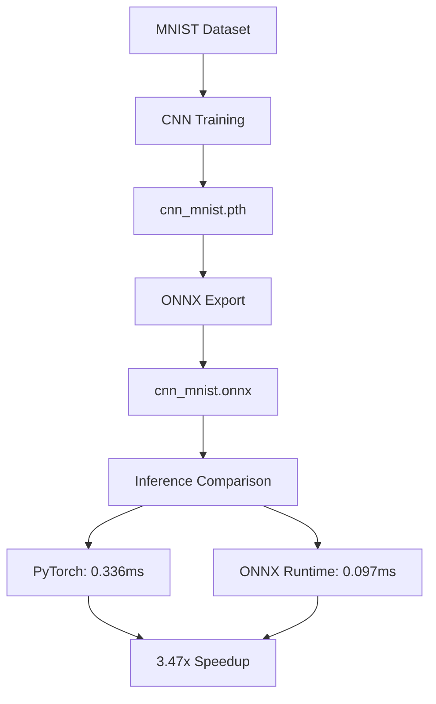

# ONNX Optimization: PyTorch vs ONNX Runtime

## Background
On-device AI 환경에서는 빠른 추론이 필수적입니다.
라즈베리파이처럼 제한된 하드웨어에서 모델을 실행하려면
PyTorch 그대로 쓰는 것보다 최적화된 런타임이 필요합니다.
이 프로젝트는 PyTorch 모델을 ONNX로 변환하고,
실제 추론 속도가 얼마나 향상되는지 측정합니다.

## Motivation
On-device AI requires fast inference on resource-constrained hardware.
This project explores how ONNX Runtime can accelerate inference 
compared to standard PyTorch.


## Pipeline
PyTorch CNN 학습 → ONNX Export → ONNX Runtime 추론 → 속도 비교
```
[MNIST Dataset]
      ↓
[CNN Training]  →  cnn_mnist.pth
      ↓
[ONNX Export]   →  cnn_mnist.onnx
      ↓
[Inference Speed Comparison]
      ↓
PyTorch: 0.336ms  vs  ONNX Runtime: 0.097ms
              ↓
         3.47x Speedup
```

## Results
| Model         | Inference Time | Speedup |
|---------------|----------------|---------|
| PyTorch       | 0.336 ms       | 1.00x   |
| ONNX Runtime  | 0.097 ms       | 3.47x   |


## Project Structure
onnx-optimization/
├── train.py        # CNN model training on MNIST
├── export.py       # Export PyTorch model to ONNX format
├── inference.py    # Inference speed comparison
└── models/
├── cnn_mnist.pth   # PyTorch model
└── cnn_mnist.onnx  # ONNX model


## Environment

- Python 3.x
- PyTorch
- ONNX Runtime

## How to Run

**1. Train the model**
```bash
python train.py
```

**2. Export to ONNX**
```bash
python export.py
```

**3. Compare inference speed**
```bash
python inference.py
```

## Key Findings
ONNX Runtime achieved **3.47x faster inference** than PyTorch.
This demonstrates the potential of model format conversion 
for edge deployment scenarios.

