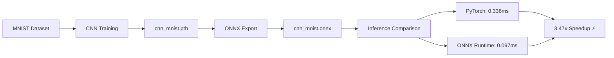

# ONNX Optimization: PyTorch vs ONNX Runtime

## Background
라즈베리파이 기반 실시간 졸음감지 시스템을 개발하던 중,
MediaPipe로 얼굴 랜드마크를 추출하고 EAR 알고리즘으로
눈 감김을 판단하는 파이프라인을 구성했습니다.
그 과정에서 제한된 하드웨어 환경에서의 추론 속도가
실시간 동작의 핵심 병목임을 인식하게 되었습니다.
이를 계기로 PyTorch 모델을 ONNX 형식으로 변환했을 때
추론 속도가 실제로 얼마나 향상되는지 직접 측정해보고자
이 프로젝트를 시작했습니다.


## Results
| Model         | Inference Time | Speedup |
|---------------|----------------|---------|
| PyTorch       | 0.336 ms       | 1.00x   |
| ONNX Runtime  | 0.097 ms       | 3.47x   |


## Project Structure

```
onnx-optimization/
├── train.py        # CNN model training on MNIST
├── export.py       # Export PyTorch model to ONNX format
├── inference.py    # Inference speed comparison
└── models/
    ├── cnn_mnist.pth    # PyTorch model
    └── cnn_mnist.onnx   # ONNX model
```
## Pipeline



## Environment

- Python 3.x
- PyTorch
- ONNX Runtime

## How to Run

**1. Train the model**
```bash
python train.py
```

**2. Export to ONNX**
```bash
python export.py
```

**3. Compare inference speed**
```bash
python inference.py
```

## Key Findings
ONNX Runtime은 PyTorch 대비 **3.47배 빠른 추론 속도**를 달성했습니다.
(0.097ms vs 0.336ms, 1000회 평균)

이 속도 향상은 ONNX Runtime의 그래프 수준 최적화에서 비롯됩니다.
불필요한 노드 제거, 연산자 융합(Operator Fusion) 등의 기법을
PyTorch 일반 추론 과정에서는 적용하지 않지만,
ONNX Runtime은 자동으로 적용합니다.

라즈베리파이처럼 연산 자원이 극도로 제한된 엣지 디바이스에서는
3.47배의 추론 지연 감소가 실시간 동작 가능 여부를 결정짓는
핵심 요소가 될 수 있습니다.
